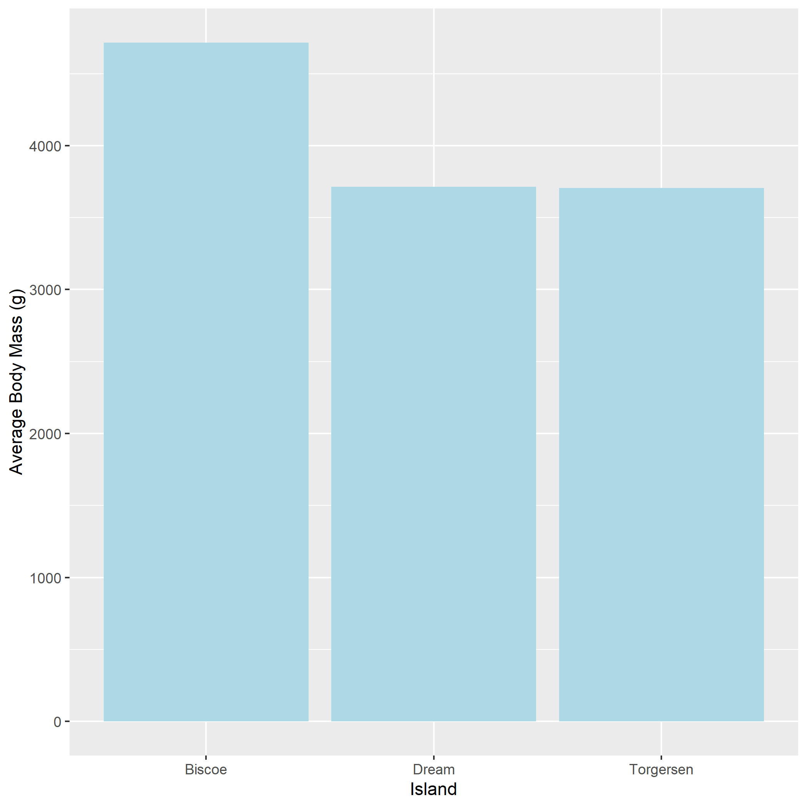

```{r setup, include=FALSE}
knitr::opts_chunk$set(echo = TRUE)
# none of these are needed to produce an rmarkdown document. They are only here to demonstrate different ways of adding code, plots, package citations, etc. to your document.
library("tidyverse")
library("ggplot2")
library("palmerpenguins")

```

# Food availability or genetic drift: Palmer penguins vary in mass island by island.

Laura Dutheil^1^\*

1.  Department of Integrative Biology, University of Guelph, Ontario, Canada

\*Corresponding Author:

email: [ldutheil\@uoguelph.ca](mailto:ldutheil@uoguelph.ca){.email}

# Abstract

This mini project explores whether the average mass of penguins differs depending on the island they're from [@lescroël2021]. Here is another source used for this project [@emslie1998].

# Introduction

Penguins of the same species can have different body masses. Using the palmer penguin dataset, we wanted to test our hypothesis that body masses would be different for each island, as island size and resource availability can contribute to increased penguin body mass.

# Methods

Using the palmer penguin dataset and RStudio, we calculated the average body mass of penguins for each separate island (Biscoe, Dream, and Torgersen). These were then plotted using the package ggplot2.

# Results

The results demonstrated that the Biscoe island had an increased average body mass compared to the two other islands, who were themselves quite similar.

# Discussion

We believe that this difference in body mass is consistent with our hypothesis that body mass would vary depending on the island type. We suspect the increase in mass seen in Biscoe is likely related to a larger island size which would provide increased habitat space for the penguins living there, and thus increased access to resources.

\newpage

# References

::: {#refs}
:::

\newpage

# Figures

```{r example_ms_figure_01, echo=FALSE, out.width = "70%", fig.align = "center", fig.cap="Average body mass of Palmer Penguins by Island"}


```
